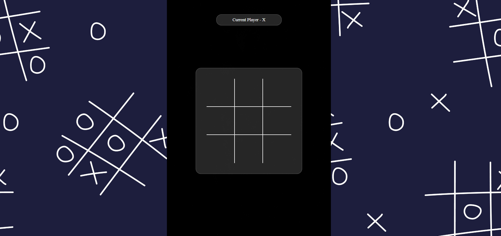

# 🎮 Tic-Tac-Toe Game

A modern implementation of the classic Tic-Tac-Toe game built with HTML, CSS, and JavaScript.

[](https://tic-tac-toe-gamma-nine-28.vercel.app/)

## 🌟 Live Demo

Try the game here: [Play Tic Tac Toe](https://tic-tac-toe-gamma-nine-28.vercel.app/)

## ✨ Features

- 🎯 Clean, responsive design
- 🔄 Turn tracking
- 🏆 Win/draw detection
- 🔁 Restart functionality
- 📱 Mobile-friendly interface

## 📁 Project Structure

```markdown
tictactoe/
├── index.html
├── style.css
├── T.js
├── README.md
├── image.png
└── n.jpg/
```

## 🛠️ Implementation Details

The game is built using:

- 📄 HTML5 for structure
- 🎨 CSS3 for styling and animations
- ⚡ JavaScript for game logic
- 🔧 DOM manipulation for dynamic updates

## 🎯 How to Play

- 👆 Click any empty square to place your mark (X or O)
- 🎮 First player to get three in a row wins
- 🔄 Click "Restart" to start a new game

## 🔑 Key Components

- 📊 3x3 game board using CSS Grid
- 👥 Player turn tracking system
- ✅ Win condition checker

## 📧 Contact

Your Name - Arpan Patra  
Email - <Thispc119@gmail.com>
